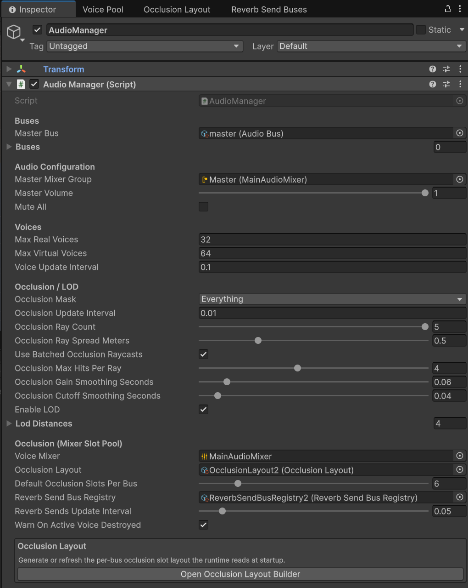
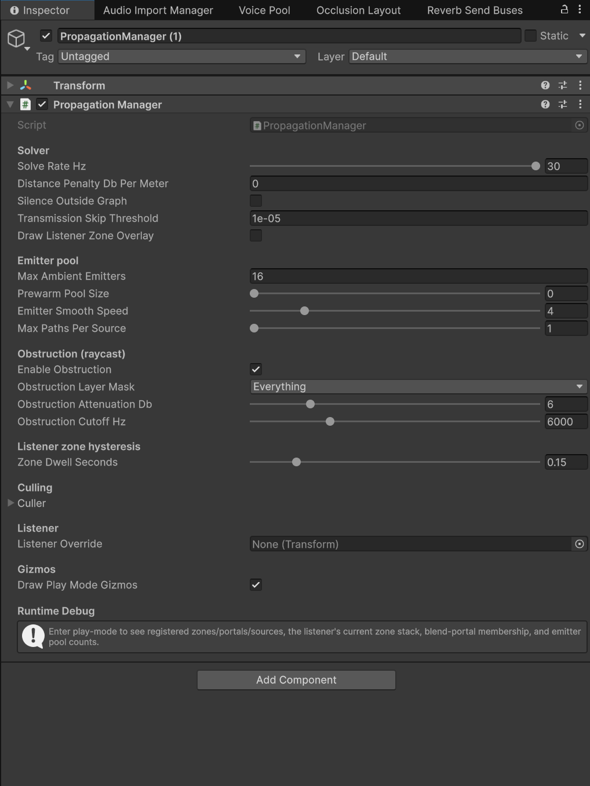
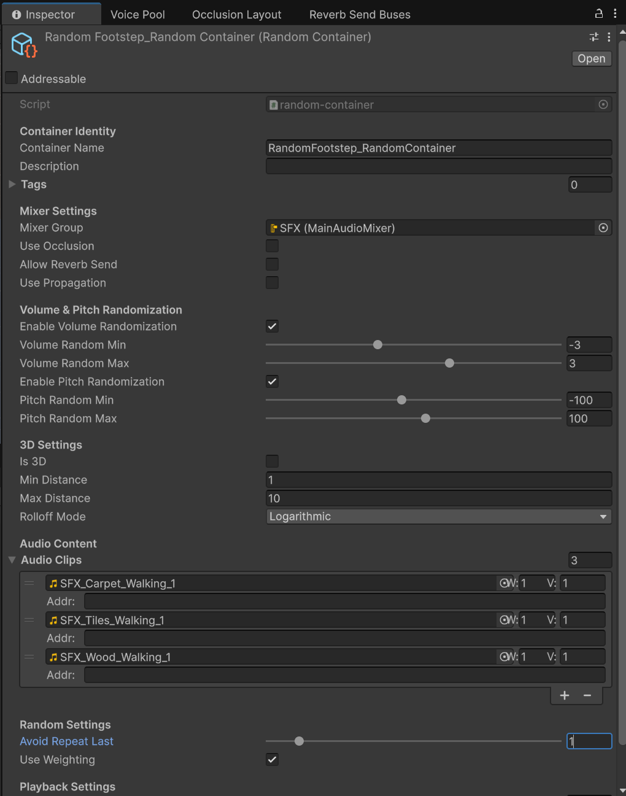
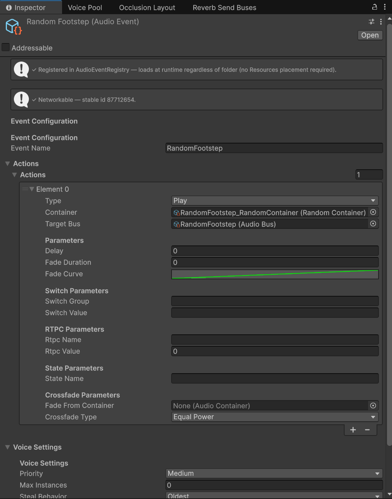
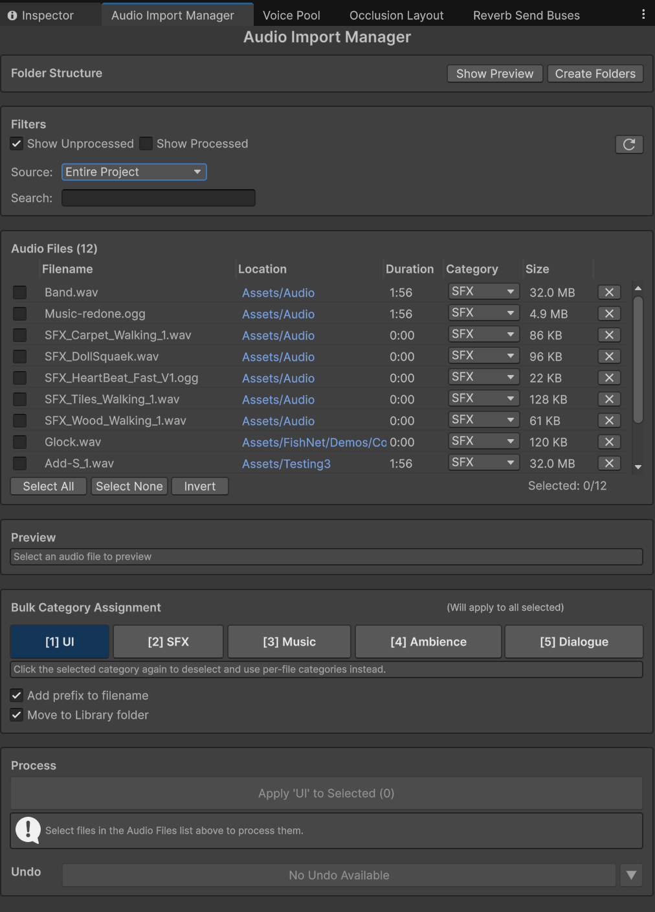

# Pepper's SFX System

**Free audio middleware for Unity — events, containers, hierarchical buses, mixer-slot occlusion, per-zone reverb, and portal-driven propagation. A complete sound-design workflow, no license fee.**

<!-- Optional: hero screenshot or short demo gif. The Quick Sound Setup Wizard
     or a scene gizmo of zones/portals would both work well here. -->

> ℹ️ **This is the free version** — the complete single-player audio middleware, shipped as compiled DLLs. A **full version** (multiplayer audio, zone-streamed memory via Addressables, extra pro tooling, and complete source code) is coming to the Unity Asset Store — with a one-click upgrade tool so nothing you build here goes to waste.











---

## Why this exists

Unity's built-in audio is fine for a "play a sound at a position" project. Real games need more: variations that don't sound repetitive, hierarchical volume control that scales to dozens of buses, reverb that changes per room, ambient sounds that route through doors and windows, and a workflow that lets sound designers iterate without touching code.

**Pepper's SFX System** is the layer between your game logic and Unity's audio API that makes those things easy. Sounds are played through **events**, organized through **containers**, mixed through **buses**, and (optionally) routed through a **zone/portal graph** for physically plausible propagation through geometry.

### Before

```csharp
public AudioClip footstepClip;
public AudioSource audioSource;

void PlayFootstep()
{
    audioSource.clip = footstepClip;
    audioSource.Play();
}
```

❌ No variations · ❌ Manual pooling · ❌ No mix structure · ❌ No spatialisation logic

### After

```csharp
public AudioEvent footstepEvent;

void PlayFootstep()
{
    footstepEvent.Post(gameObject, transform.position);
}
```

✅ Built-in variations · ✅ Automatic pooling · ✅ Hierarchical mixing · ✅ Spatial routing comes free

---

## Highlights

### 🎵 Core SFX
- **Events + Containers** — Random (weighted, with repeat avoidance), Sequence (Forward / Reverse / PingPong / Random), Switch (state-driven selection), Blend (RTPC-driven crossfading), Routing (layered playback).
- **Hierarchical Buses** — a tree of volume controls with auto-propagating parent volumes, mute/solo, ducking, and Unity AudioMixer integration.
- **Click-free voice pool** — pooled, priority-driven voices with stealing, distance LOD, and virtualization. Voices start on DSP-buffer boundaries and never rebuild filters mid-play, so reuse is structurally click-free.
- **States & RTPCs** — group-based state machines that drive bus volumes, switches, and effect parameters in one transition; real-time parameters with smooth transitions.
- **Multi-position audio** — one sound playing from N places at once (a river, a long wall of rain), sample-accurately synced.
- **Clip warming** — pre-load a clip's audio data ahead of first play (`WarmClip` / `WarmContainer`), so streamed music and compressed dialogue never hitch on their first note.

### 🌍 Spatial audio
- **Ambient propagation** — a zone/portal graph routes long-running ambient beds (rain, wind, machinery) through real geometry. Rain heard *from the window* when you're in another room; doors that animate smoothly between muffled and clear.
- **Per-zone reverb** — every acoustic space drives its own reverb character; SFX automatically send to the room they're fired in.
- **Mixer-slot occlusion** — walls muffle sound without clicks or per-source filter hacks. Multi-ray sampling produces smooth gradients across wall edges instead of on/off steps.
- **Soft zone boundaries** — reverb and volume fade smoothly across a zone's surface instead of switching at the border.

---

## 🛠️ The editor windows — what each one does for you

Everything lives under `Window ▸ Audio System`. In the order you'll likely meet them:

| Window | What it does for you |
|---|---|
| **Quick Sound Setup Wizard** | Go from an audio file to a playable sound in one click — creates the bus, container and event and wires them together. The fastest way to get your first sound working (under 2 minutes). |
| **Import Manager** | Drop audio files in, pick a category (SFX / Music / UI / Dialogue…), and the correct Unity import settings are applied automatically. No more per-file compression fiddling — and no accidentally streaming your footsteps. |
| **Audio Explorer** | Every event, container and bus in one browsable window — click to inspect, press play to preview. No more hunting through project folders to find "that one footstep event". |
| **Voice Pool Debug** | A live table of everything currently playing — which clip, which event, which bus, how loud, how far — with a one-click stop per voice. Your first stop whenever something *sounds* wrong. |
| **Container Validator** | Scans every container for common authoring mistakes (missing clips, bad weights, broken references) and offers one-click fixes. Run it before a build, sleep better. |
| **Occlusion Layout** | One-click setup for occlusion: scans your project and auto-builds the mixer plumbing that wall-muffling needs. Run it once, forget it exists. |
| **Reverb Send Buses** | Create and manage per-room reverb from a single overview — generate, validate and apply each room's reverb bus without hand-editing the mixer. |
| **Audio Event IDs** | A health-check for your events: gives each one a permanent, rename-proof ID and flags any duplicates. Keeps your project future-proof (these IDs are also what the full version's multiplayer uses on the wire). |
| **Toggle Icon Overlays** | Puts little audio-type icons on your assets in the Project window, so events, containers and buses are recognizable at a glance. |

Plus **custom inspectors with live diagnostics** on `AudioZone`, `AudioPortal`, `PropagationManager`, `ReverbSendBus`, and `AudioManager` (including a live voice-pool health readout while playing).

---

## Documentation

Full guides + API reference live in [`Documentation~/`](https://github.com/IamAmirPepper/Pepper.SFX_System/tree/main/Documentation~).

- **[USER_GUIDE.md](https://github.com/IamAmirPepper/Pepper.SFX_System/tree/main/Documentation~/USER_GUIDE.md)** — Introduction → Quick Start → Cookbook → Manual → Migration. One file for everything narrative.
  - **Quick Start** — first sound playing in 2–10 minutes
  - **Cookbook** — copy-paste recipes for footsteps, UI sounds, weapons, music systems, ambient propagation, per-zone reverb, and debugging
  - **Manual** — architecture and design rationale, every subsystem chapter-by-chapter
- **[API_REFERENCE.md](https://github.com/IamAmirPepper/Pepper.SFX_System/tree/main/Documentation~/API_REFERENCE.md)** — every public type, method, property, and inspector field.

---

## Install

**Requirements**: Unity 6000.0 or later. Git installed (Unity Package Manager fetches from Git).

1. **Window → Package Manager → + → Add package from git URL**
2. Paste:
   ```
   https://github.com/IamAmirPepper/Pepper.SFX_System.git
   ```
3. Done. The package appears under "Pepper's SFX System" in the manager.

To pin to a specific version, append `#v3.0.0` (or any tag/branch) to the URL.

---

## Free vs Full

| | **Free (this package)** | **Full (Asset Store, coming soon)** |
|---|---|---|
| Events, containers, buses, states, RTPCs | ✅ | ✅ |
| Voice pool, occlusion, per-zone reverb, propagation | ✅ | ✅ |
| Authoring & debug windows (table above) | ✅ | ✅ + **Mixer**, **Audio Profiler**, **EQ Spectrum Visualizer**, **Loading Validator** |
| **Multiplayer audio** (NGO / FishNet) | — | ✅ |
| **Zone-streamed audio memory** (Addressables) | — | ✅ |
| Source code | Compiled DLLs | ✅ Full source |
| Upgrade path | — | ✅ One-click migration — everything you author in free carries over |

Nothing you build in the free version is throwaway: the full version ships an upgrade tool that migrates your entire project's audio assets in a few minutes.

---

## What's new in 3.0.0

- 🛠️ **The editor suite grew** — Audio Explorer, Import Manager, Voice Pool Debug, Audio Event IDs, and Container Validator join the wizard and the spatial-authoring windows (see the table above).
- 🔥 **Clip warming** — `WarmClip` / `WarmClips` / `WarmContainer` pre-load audio data on your schedule, killing first-play hitches for streamed music and compressed dialogue. Ambient sources warm themselves automatically.
- 🔧 **Core runtime hardening** — live voice-pool health diagnostics (including a warning when an emitter is destroyed mid-sound), cleaner session resets, quieter logs, and faster voice stealing under load.
- 📚 **Docs refreshed** throughout.

Full release notes: [CHANGELOG.md](./CHANGELOG.md).

---

## License

**Proprietary.** Free to use in your Unity projects. Do not redistribute or modify. See [LICENSE.txt](./LICENSE.txt).

For licensing questions or commercial arrangements, contact the author below.

---

## Author

**Amir Pepper**
[amirpepper96@gmail.com](mailto:amirpepper96@gmail.com)
[github.com/IamAmirPepper](https://github.com/IamAmirPepper)


## Images

[](https://unity.com/)
[](./package.json)
[](./LICENSE.txt)
[](https://github.com/IamAmirPepper/Pepper.SFX_System/tree/main/Documentation~)

